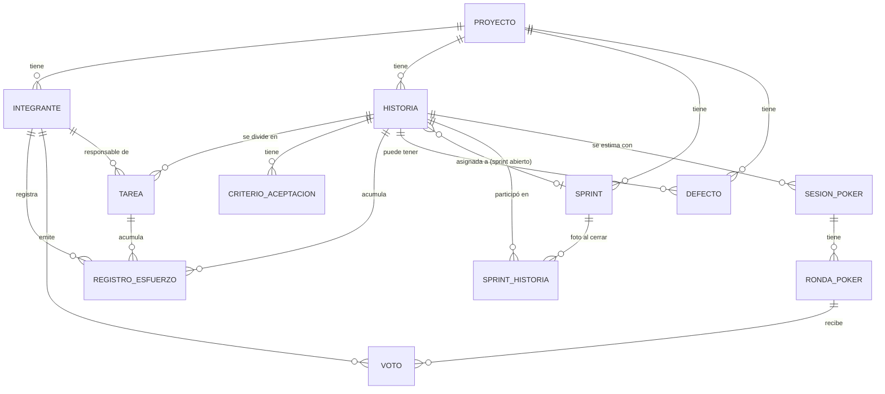

# Modelo de datos (borrador · Sprint 0)

Propuesta de Mariano para discutir y cerrar entre los tres antes de convertirla en la
migración inicial (TEC-03, Sprint 1). Basado en las entidades mencionadas en el Plan de
trabajo (sección 2.1) y en los ejemplos de la Guía de desarrollo.

## Diagrama entidad-relación

## Entidades y campos propuestos

### Proyecto (E1 · Juan Pablo)
| Campo | Tipo | Notas |
|---|---|---|
| id | bigserial PK | |
| nombre | text | único, 3-100 caracteres |
| descripcion | text | |
| fecha_inicio | date | |
| fecha_fin | date | > fecha_inicio |
| estado | text | Planificado / En curso / Finalizado |
| creado_en | timestamptz | default now() |

### Integrante (E1 · Juan Pablo, vinculado a TEC-05 · Mariano)
| Campo | Tipo | Notas |
|---|---|---|
| id | bigserial PK | |
| proyecto_id | bigint FK | |
| nombre | text | |
| email | text | único dentro del proyecto |
| rol | text | AgileEnabler / ProductBuilder — un solo AgileEnabler por proyecto |
| activo | bool | baja lógica, no se borra si tiene esfuerzo registrado |
| auth_user_id | uuid | referencia al usuario de Supabase Auth (TEC-05) |

### Historia (E2 · Mariano — Product Backlog)
| Campo | Tipo | Notas |
|---|---|---|
| id | bigserial PK | |
| proyecto_id | bigint FK | |
| numero | int | correlativo por proyecto (HU-1, HU-2, ...) |
| titulo | text | obligatorio |
| descripcion | text | |
| prioridad | text | Alta / Media / Baja |
| estado | text | Pendiente → En sprint → En progreso → Hecho |
| story_points | int | nullable, escala Fibonacci (0,1,2,3,5,8,13,21) |
| orden | int | para el orden manual dentro de la misma prioridad (HU-09) |
| sprint_id | bigint FK | nullable, sprint **abierto** donde está asignada ahora (no sirve para historial) |
| horas_estimadas | numeric | HU-23, suma de tareas si las tiene |
| completada_en | date | nullable, se completa al pasar a Hecho (HU-13); la usa el burndown |

### CriterioAceptacion (E2 · Mariano)
| Campo | Tipo | Notas |
|---|---|---|
| id | bigserial PK | |
| historia_id | bigint FK | |
| descripcion | text | |
| cumplido | bool | default false |

### Tarea (E5 · Carolina, HU-25)
| Campo | Tipo | Notas |
|---|---|---|
| id | bigserial PK | |
| historia_id | bigint FK | |
| titulo | text | |
| responsable_id | bigint FK → Integrante | |
| horas_estimadas | numeric | no se edita si la tarea está completada |
| completada | bool | |

### Sprint (E3 · Juan Pablo)
| Campo | Tipo | Notas |
|---|---|---|
| id | bigserial PK | |
| proyecto_id | bigint FK | |
| numero | int | correlativo |
| objetivo | text | Sprint Goal, obligatorio |
| fecha_inicio | date | dentro del rango del proyecto, sin superponerse con otro sprint |
| fecha_fin | date | |
| estado | text | Planificado / Activo / Cerrado |
| sp_planificados | int | foto al cerrar (CA-14.3) |
| sp_completados | int | foto al cerrar |

### SprintHistoria (foto de cierre, pedido por Juan Pablo en la revisión de esta PR)
`historia.sprint_id` solo indica el sprint **abierto actual** de una historia; al cerrar el
sprint esa historia puede volver a Pendiente (HU-14 CA-14.2) y esa referencia se pierde. Esta
tabla guarda, para cada sprint ya cerrado, qué historias participaron y con qué SP, aunque la
historia se re-estime después o entre a otro sprint más adelante. La necesitan HU-32
(% completadas por sprint) y HU-37 (reporte de sprint) para poder calcular sobre sprints
viejos sin recalcular nada.

| Campo | Tipo | Notas |
|---|---|---|
| sprint_id | bigint FK | |
| historia_id | bigint FK | |
| story_points | int | SP de la historia en el momento del cierre (no el actual) |
| completada | bool | si estaba en Hecho cuando se cerró el sprint |

### SesionPoker / RondaPoker / Voto (E4 · Mariano — Planning Poker)
| Tabla | Campo | Tipo | Notas |
|---|---|---|---|
| sesion_poker | id | bigserial PK | |
| sesion_poker | historia_id | bigint FK | una sesión abierta por historia |
| sesion_poker | estado | text | Abierta / Cerrada |
| sesion_poker | valor_acordado | int | nullable hasta HU-22 |
| ronda_poker | id | bigserial PK | |
| ronda_poker | sesion_id | bigint FK | |
| ronda_poker | numero | int | correlativo dentro de la sesión |
| ronda_poker | revelada | bool | |
| voto | id | bigserial PK | |
| voto | ronda_id | bigint FK | |
| voto | integrante_id | bigint FK | |
| voto | valor | int | escala Fibonacci; **no se expone hasta revelar** (regla de aplicación, no solo de BD) |

### RegistroEsfuerzo (E5 · Carolina)
| Campo | Tipo | Notas |
|---|---|---|
| id | bigserial PK | |
| integrante_id | bigint FK | |
| historia_id | bigint FK | nullable si es por tarea |
| tarea_id | bigint FK | nullable si es por historia |
| fecha | date | no timestamp — evita corrimientos de zona horaria |
| actividad | text | |
| horas | numeric | > 0 y ≤ 24; total diario del integrante ≤ 24 |

### Defecto (E6 · Carolina)
| Campo | Tipo | Notas |
|---|---|---|
| id | bigserial PK | |
| proyecto_id | bigint FK | |
| historia_id | bigint FK | nullable |
| descripcion | text | |
| severidad | text | Crítica / Alta / Media / Baja |
| estado | text | Abierto → En progreso → Resuelto → Cerrado (y Resuelto → Reabierto) |
| sprint_deteccion_id | bigint FK | |
| sprint_resolucion_id | bigint FK | nullable, ≥ sprint_deteccion |

## Restricciones de unicidad (pedidas por Juan Pablo en la revisión de esta PR)

| Tabla | Columnas | Motivo |
|---|---|---|
| historia | `(proyecto_id, numero)` | el número de HU es correlativo **por proyecto**, no puede repetirse dentro del mismo |
| sprint | `(proyecto_id, numero)` | mismo criterio que historia |
| integrante | `(proyecto_id, email)` | el email no se repite dentro de un proyecto (CA-03.1), pero sí puede pertenecer a otro proyecto distinto |
| voto | `(ronda_id, integrante_id)` | un integrante vota una sola vez por ronda (CA-18.1); revotar es un `UPDATE`, no un `INSERT` |

## Puntos para discutir en Sprint 0

1. ~~¿`auth_user_id` en `Integrante` alcanza, o conviene una tabla puente...?~~ **Resuelto
   (Juan Pablo, revisión de esta PR):** `auth_user_id` nullable alcanza; se completa en el
   primer login matcheando por email.
2. ~~Confirmar escala de Story Points~~ **Resuelto por ahora (Juan Pablo):** Fibonacci 0-21,
   hasta que los profesores confirmen la pregunta abierta #7 del Plan de trabajo.
3. `Voto.valor` en la tabla real: aunque HTTP/servicio no lo exponga antes de revelar,
   alguien con acceso directo a la base sí lo vería. Para la demo alcanza (es la regla de
   negocio la que se evalúa), pero vale la pena mencionarlo si preguntan por seguridad.
4. Nombres de tablas en español, columnas en snake_case — a definir como convención con el
   equipo para que coincida con los paquetes Go (`project`, `sprint`, `estimation`, etc. en
   inglés según la Guía, sección 5).
