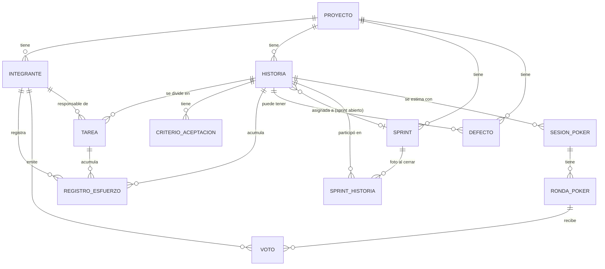

# Modelo de datos (acordado · Sprint 0)

Base de la migración inicial (TEC-03, Sprint 1), que está en `migrations/0001_modelo_inicial.sql`. Se armó a partir
de las entidades del Plan de trabajo (sección 2.1) y de los ejemplos de la Guía de desarrollo. Los tests con base de
datos de `internal/store/postgres` comprueban las restricciones de este documento.

**Estado:** aprobado en la revisión de Juan Pablo (PR #56) y cerrado en la Review del Sprint 0.
Queda pendiente la conformidad de Carolina sobre sus entidades (Tarea, RegistroEsfuerzo y Defecto).
Cualquier cambio posterior se hace con una migración nueva y se actualiza este documento.

## Diagrama entidad-relación

El diagrama usa los nombres de las entidades; las tablas reales siguen la convención de abajo.

## Convención de nombres

Tablas en plural y en español, columnas en `snake_case` y en español (como el ejemplo de la Guía,
sección 5.6). Los paquetes de Go siguen en inglés (Guía, sección 5). Las claves foráneas se llaman
`<entidad>_id` y todas las tablas tienen `id bigserial` como clave primaria, salvo `sprint_historias`.

| Entidad | Tabla |
|---|---|
| Proyecto | `proyectos` |
| Integrante | `integrantes` |
| Historia | `historias` |
| CriterioAceptacion | `criterios_aceptacion` |
| Tarea | `tareas` |
| Sprint | `sprints` |
| SprintHistoria | `sprint_historias` |
| SesionPoker | `sesiones_poker` |
| RondaPoker | `rondas_poker` |
| Voto | `votos` |
| RegistroEsfuerzo | `registros_esfuerzo` |
| Defecto | `defectos` |

## Entidades y campos

### Proyecto (E1 · Juan Pablo)
| Campo | Tipo | Notas |
|---|---|---|
| id | bigserial PK | |
| nombre | text | único, 3-100 caracteres |
| descripcion | text | |
| fecha_inicio | date | |
| fecha_fin | date | > fecha_inicio |
| estado | text | Planificado / En curso / Finalizado |
| creado_en | timestamptz | default now() |

### Integrante (E1 · Juan Pablo, vinculado a TEC-05 · Mariano)
| Campo | Tipo | Notas |
|---|---|---|
| id | bigserial PK | |
| proyecto_id | bigint FK | |
| nombre | text | |
| email | text | único dentro del proyecto |
| rol | text | AgileEnabler / ProductBuilder — un solo AgileEnabler **activo** por proyecto |
| activo | bool | baja lógica, no se borra si tiene esfuerzo registrado |
| auth_user_id | uuid | referencia al usuario de Supabase Auth (TEC-05) |

### Historia (E2 · Mariano — Product Backlog)
| Campo | Tipo | Notas |
|---|---|---|
| id | bigserial PK | |
| proyecto_id | bigint FK | |
| numero | int | correlativo por proyecto (HU-1, HU-2, ...) |
| titulo | text | obligatorio |
| descripcion | text | |
| prioridad | text | Alta / Media / Baja |
| estado | text | Pendiente → En sprint → En progreso → Hecho |
| story_points | int | nullable, escala Fibonacci (0,1,2,3,5,8,13,21) |
| orden | int | para el orden manual dentro de la misma prioridad (HU-09) |
| sprint_id | bigint FK | nullable, sprint **abierto** donde está asignada ahora (no sirve para historial) |
| horas_estimadas | numeric | nullable, HU-23. Solo se carga si la historia **no** tiene tareas; si las tiene, su estimación es la suma de las horas de sus tareas y se calcula al consultar (CA-23.2). Así hay una sola fuente de verdad |
| completada_en | date | nullable, se completa al pasar a Hecho (HU-13); la usa el burndown |

### CriterioAceptacion (E2 · Mariano)
| Campo | Tipo | Notas |
|---|---|---|
| id | bigserial PK | |
| historia_id | bigint FK | |
| descripcion | text | |
| cumplido | bool | default false |

### Tarea (E5 · Carolina, HU-25)
| Campo | Tipo | Notas |
|---|---|---|
| id | bigserial PK | |
| historia_id | bigint FK | |
| titulo | text | |
| responsable_id | bigint FK → Integrante | |
| horas_estimadas | numeric | no se edita si la tarea está completada |
| completada | bool | |

### Sprint (E3 · Juan Pablo)
| Campo | Tipo | Notas |
|---|---|---|
| id | bigserial PK | |
| proyecto_id | bigint FK | |
| numero | int | correlativo |
| objetivo | text | Sprint Goal, obligatorio |
| fecha_inicio | date | dentro del rango del proyecto, sin superponerse con otro sprint |
| fecha_fin | date | |
| estado | text | Planificado / Activo / Cerrado |
| sp_planificados | int | foto al cerrar (CA-14.3) |
| sp_completados | int | foto al cerrar |

### SprintHistoria (foto de cierre, pedido por Juan Pablo en la revisión de esta PR)
`historia.sprint_id` solo indica el sprint **abierto actual** de una historia; al cerrar el
sprint esa historia puede volver a Pendiente (HU-14 CA-14.2) y esa referencia se pierde. Esta
tabla guarda, para cada sprint ya cerrado, qué historias participaron y con qué SP, aunque la
historia se re-estime después o entre a otro sprint más adelante. La necesitan HU-32
(% completadas por sprint) y HU-37 (reporte de sprint) para poder calcular sobre sprints
viejos sin recalcular nada.

| Campo | Tipo | Notas |
|---|---|---|
| sprint_id | bigint FK | |
| historia_id | bigint FK | |
| story_points | int | nullable. SP de la historia en el momento del cierre (no el actual); `NULL` si estaba sin estimar, para que HU-30 (CA-30.2) pueda avisarlo también en sprints cerrados |
| completada | bool | si estaba en Hecho cuando se cerró el sprint |

La clave primaria es `(sprint_id, historia_id)`. Para un sprint **cerrado**, las métricas (HU-30, HU-31, HU-32 y
HU-37) deben leer de esta tabla y no del estado actual de las historias.

### SesionPoker / RondaPoker / Voto (E4 · Mariano — Planning Poker)
| Tabla | Campo | Tipo | Notas |
|---|---|---|---|
| sesiones_poker | id | bigserial PK | |
| sesiones_poker | historia_id | bigint FK | una sesión abierta por historia (CA-17.2, ver unicidad) |
| sesiones_poker | estado | text | Abierta / Cerrada |
| sesiones_poker | valor_acordado | int | nullable hasta HU-22 |
| rondas_poker | id | bigserial PK | |
| rondas_poker | sesion_id | bigint FK | |
| rondas_poker | numero | int | correlativo dentro de la sesión (CA-21.3) |
| rondas_poker | revelada | bool | |
| votos | id | bigserial PK | |
| votos | ronda_id | bigint FK | |
| votos | integrante_id | bigint FK | |
| votos | valor | int | escala Fibonacci (siempre un número); **no se expone hasta revelar** (regla de aplicación, no solo de BD) |

### RegistroEsfuerzo (E5 · Carolina)
| Campo | Tipo | Notas |
|---|---|---|
| id | bigserial PK | |
| integrante_id | bigint FK | |
| historia_id | bigint FK | nullable si es por tarea |
| tarea_id | bigint FK | nullable si es por historia |
| fecha | date | no timestamp — evita corrimientos de zona horaria |
| actividad | text | |
| horas | numeric | > 0 y ≤ 24; total diario del integrante ≤ 24 |

### Defecto (E6 · Carolina)
| Campo | Tipo | Notas |
|---|---|---|
| id | bigserial PK | |
| proyecto_id | bigint FK | |
| historia_id | bigint FK | nullable |
| descripcion | text | |
| severidad | text | Crítica / Alta / Media / Baja |
| estado | text | Abierto → En progreso → Resuelto → Cerrado (y Resuelto → Reabierto) |
| sprint_deteccion_id | bigint FK | |
| sprint_resolucion_id | bigint FK | nullable, ≥ sprint_deteccion |

## Restricciones de unicidad

| Tabla | Columnas | Motivo |
|---|---|---|
| `proyectos` | `lower(nombre)` | el nombre no se repite sin distinguir mayúsculas (HU-01) |
| `historias` | `(proyecto_id, numero)` | el número de HU es correlativo **por proyecto**, no puede repetirse dentro del mismo |
| `sprints` | `(proyecto_id, numero)` | mismo criterio que historias |
| `integrantes` | `(proyecto_id, email)` | el email no se repite dentro de un proyecto (CA-03.1), tampoco el de alguien dado de baja, pero sí puede pertenecer a otro proyecto distinto |
| `integrantes` | `(proyecto_id)` solo donde `rol = 'AgileEnabler' AND activo` (índice único parcial) | un solo Agile Enabler **activo** por proyecto: si se da de baja, se puede registrar otro (HU-03, RN6) |
| `sprint_historias` | clave primaria `(sprint_id, historia_id)` | una fila por historia en cada sprint cerrado |
| `sesiones_poker` | `(historia_id)` solo donde `estado = 'Abierta'` (índice único parcial) | una única sesión abierta por historia (CA-17.2) |
| `rondas_poker` | `(sesion_id, numero)` | la numeración de rondas no se repite dentro de la sesión (CA-21.3) |
| `votos` | `(ronda_id, integrante_id)` | un integrante vota una sola vez por ronda (CA-18.1); revotar es un `UPDATE`, no un `INSERT` |

## Restricciones de valores (`CHECK`)

| Tabla.columna | Regla | Motivo |
|---|---|---|
| `historias.story_points`, `sprint_historias.story_points`, `sesiones_poker.valor_acordado`, `votos.valor` | `IN (0, 1, 2, 3, 5, 8, 13, 21)` | escala Fibonacci acordada (CA-16.1, CA-18.4, CA-22.1) |
| `historias.prioridad` | `IN ('Alta', 'Media', 'Baja')` | CA-05.2 |
| `historias.estado` | `IN ('Pendiente', 'En sprint', 'En progreso', 'Hecho')` | CA-08.1 |
| `proyectos.fecha_fin` | `> fecha_inicio` | validación de HU-01 |
| `historias.horas_estimadas`, `tareas.horas_estimadas` | `> 0` cuando no es nulo | CA-23.1 |
| `registros_esfuerzo.horas` | `> 0 AND <= 24` | HU-24 |
| `registros_esfuerzo` | `historia_id IS NOT NULL OR tarea_id IS NOT NULL` | todo registro pertenece a una historia o a una tarea |

La escala también existe en el código de Go: debe haber una sola constante que la defina, y los
tests deben comprobar que coincide con el `CHECK` de la migración.

## Reglas que valida la aplicación (no la base)

Dependen de varias filas o de datos de otras tablas, así que no se expresan con un `CHECK`:

- El total diario de horas de un integrante no supera las 24 (HU-24).
- Los sprints de un proyecto no se superponen y quedan dentro del rango del proyecto.
- `defectos.sprint_resolucion_id` no es anterior a `sprint_deteccion_id`.
- Una historia solo pasa a Hecho si todos sus criterios de aceptación están cumplidos (CA-08.2).
- No se eliminan historias Hechas ni asignadas a un sprint cerrado (CA-06.2).
- Los votos no se exponen antes de revelar la ronda (CA-18.2 y CA-18.3).

## Seguridad de la base

Supabase publica cada tabla del esquema `public` por una API que se maneja con la clave `anon`. Para que
esa API no pueda leer ni escribir nuestras tablas (en particular `votos` antes de revelar), **todas las tablas
se crean con RLS activado y sin políticas**. La aplicación entra por `DATABASE_URL` con el usuario `postgres`,
que no está sujeto a RLS, así que no se ve afectada. Un test de TEC-03 comprueba que las 12 tablas tengan RLS activado. La tabla `goose_db_version` (donde goose anota las
migraciones aplicadas) no es del modelo, pero también queda en `public` y expuesta: la migración `0002` le activa RLS.

## Decisiones tomadas en el Sprint 0

1. ~~¿`auth_user_id` en `Integrante` alcanza, o conviene una tabla puente...?~~ **Resuelto
   (Juan Pablo, revisión del PR #56):** `auth_user_id` nullable alcanza; se completa en el
   primer login matcheando por email.
2. ~~Confirmar escala de Story Points~~ **Resuelto (equipo, Review del Sprint 0):** Fibonacci
   0, 1, 2, 3, 5, 8, 13 y 21. Un voto siempre es un número de la escala.
3. ~~`Voto.valor` visible con acceso directo a la base~~ **Resuelto:** RLS activado sin políticas
   en todas las tablas (ver "Seguridad de la base"). La regla de no exponer votos antes de revelar
   sigue siendo también una regla de la aplicación.
4. ~~Convención de nombres~~ **Resuelto:** tablas en plural y en español, columnas en `snake_case`
   (ver "Convención de nombres").

## Decisiones de la migración inicial (TEC-03)

La migración sigue este documento al pie de la letra. Dos cosas quedaron fuera a propósito y se resuelven con una
migración nueva cuando la historia que las necesita las defina:

- **Sin `CHECK` en los estados** (`proyectos.estado`, `sprints.estado`, `integrantes.rol`, etc.): este documento los
  describe en las notas pero no los lista en "Restricciones de valores". Hoy los controla la aplicación.
- **Sin borrado en cascada** de las claves foráneas: eliminar una historia con criterios o tareas falla hasta que HU-06
  (editar y eliminar ítem) decida qué pasa con ellos.
