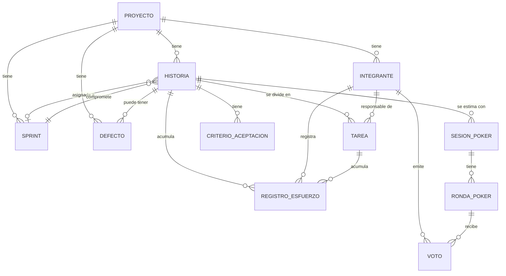

# Modelo de datos (borrador · Sprint 0)

Propuesta de Mariano para discutir y cerrar entre los tres antes de convertirla en la
migración inicial (TEC-03, Sprint 1). Basado en las entidades mencionadas en el Plan de
trabajo (sección 2.1) y en los ejemplos de la Guía de desarrollo.

## Diagrama entidad-relación

## Entidades y campos propuestos

### Proyecto (E1 · Juan Pablo)
| Campo | Tipo | Notas |
|---|---|---|
| id | bigserial PK | |
| nombre | text | único, 3-100 caracteres |
| descripcion | text | |
| fecha_inicio | date | |
| fecha_fin | date | > fecha_inicio |
| estado | text | Planificado / En curso / Finalizado |
| creado_en | timestamptz | default now() |

### Integrante (E1 · Juan Pablo, vinculado a TEC-05 · Mariano)
| Campo | Tipo | Notas |
|---|---|---|
| id | bigserial PK | |
| proyecto_id | bigint FK | |
| nombre | text | |
| email | text | único dentro del proyecto |
| rol | text | AgileEnabler / ProductBuilder — un solo AgileEnabler por proyecto |
| activo | bool | baja lógica, no se borra si tiene esfuerzo registrado |
| auth_user_id | uuid | referencia al usuario de Supabase Auth (TEC-05) |

### Historia (E2 · Mariano — Product Backlog)
| Campo | Tipo | Notas |
|---|---|---|
| id | bigserial PK | |
| proyecto_id | bigint FK | |
| numero | int | correlativo por proyecto (HU-1, HU-2, ...) |
| titulo | text | obligatorio |
| descripcion | text | |
| prioridad | text | Alta / Media / Baja |
| estado | text | Pendiente → En sprint → En progreso → Hecho |
| story_points | int | nullable, escala Fibonacci (0,1,2,3,5,8,13,21) |
| orden | int | para el orden manual dentro de la misma prioridad (HU-09) |
| sprint_id | bigint FK | nullable, sprint abierto donde está asignada |
| horas_estimadas | numeric | HU-23, suma de tareas si las tiene |

### CriterioAceptacion (E2 · Mariano)
| Campo | Tipo | Notas |
|---|---|---|
| id | bigserial PK | |
| historia_id | bigint FK | |
| descripcion | text | |
| cumplido | bool | default false |

### Tarea (E5 · Carolina, HU-25)
| Campo | Tipo | Notas |
|---|---|---|
| id | bigserial PK | |
| historia_id | bigint FK | |
| titulo | text | |
| responsable_id | bigint FK → Integrante | |
| horas_estimadas | numeric | no se edita si la tarea está completada |
| completada | bool | |

### Sprint (E3 · Juan Pablo)
| Campo | Tipo | Notas |
|---|---|---|
| id | bigserial PK | |
| proyecto_id | bigint FK | |
| numero | int | correlativo |
| objetivo | text | Sprint Goal, obligatorio |
| fecha_inicio | date | dentro del rango del proyecto, sin superponerse con otro sprint |
| fecha_fin | date | |
| estado | text | Planificado / Activo / Cerrado |
| sp_planificados | int | foto al cerrar (CA-14.3) |
| sp_completados | int | foto al cerrar |

### SesionPoker / RondaPoker / Voto (E4 · Mariano — Planning Poker)
| Tabla | Campo | Tipo | Notas |
|---|---|---|---|
| sesion_poker | id | bigserial PK | |
| sesion_poker | historia_id | bigint FK | una sesión abierta por historia |
| sesion_poker | estado | text | Abierta / Cerrada |
| sesion_poker | valor_acordado | int | nullable hasta HU-22 |
| ronda_poker | id | bigserial PK | |
| ronda_poker | sesion_id | bigint FK | |
| ronda_poker | numero | int | correlativo dentro de la sesión |
| ronda_poker | revelada | bool | |
| voto | id | bigserial PK | |
| voto | ronda_id | bigint FK | |
| voto | integrante_id | bigint FK | |
| voto | valor | int | escala Fibonacci; **no se expone hasta revelar** (regla de aplicación, no solo de BD) |

### RegistroEsfuerzo (E5 · Carolina)
| Campo | Tipo | Notas |
|---|---|---|
| id | bigserial PK | |
| integrante_id | bigint FK | |
| historia_id | bigint FK | nullable si es por tarea |
| tarea_id | bigint FK | nullable si es por historia |
| fecha | date | no timestamp — evita corrimientos de zona horaria |
| actividad | text | |
| horas | numeric | > 0 y ≤ 24; total diario del integrante ≤ 24 |

### Defecto (E6 · Carolina)
| Campo | Tipo | Notas |
|---|---|---|
| id | bigserial PK | |
| proyecto_id | bigint FK | |
| historia_id | bigint FK | nullable |
| descripcion | text | |
| severidad | text | Crítica / Alta / Media / Baja |
| estado | text | Abierto → En progreso → Resuelto → Cerrado (y Resuelto → Reabierto) |
| sprint_deteccion_id | bigint FK | |
| sprint_resolucion_id | bigint FK | nullable, ≥ sprint_deteccion |

## Puntos para discutir en Sprint 0

1. ¿`auth_user_id` en `Integrante` alcanza, o conviene una tabla puente para permitir que
   un integrante exista antes de tener login (por ejemplo, cargado por el Agile Enabler
   antes de que esa persona se registre)?
2. Confirmar escala de Story Points: Fibonacci 0-21 (+ "?") — está en preguntas abiertas
   del Plan de trabajo (punto 7).
3. `Voto.valor` en la tabla real: aunque HTTP/servicio no lo exponga antes de revelar,
   alguien con acceso directo a la base sí lo vería. Para la demo alcanza (es la regla de
   negocio la que se evalúa), pero vale la pena mencionarlo si preguntan por seguridad.
4. Nombres de tablas en español, columnas en snake_case — a definir como convención con el
   equipo para que coincida con los paquetes Go (`project`, `sprint`, `estimation`, etc. en
   inglés según la Guía, sección 5).
